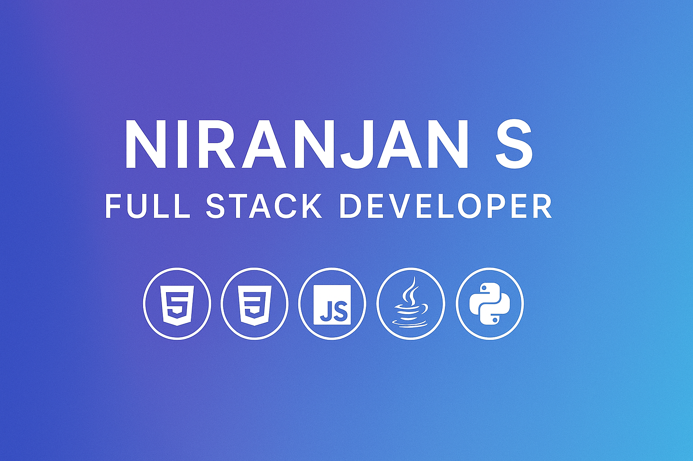

# Portfolio

<!-- Banner -->

  

# 🌐 Personal Portfolio Website — Niranjan S

This is my personal portfolio website built using **HTML, CSS, and JavaScript**.  
It showcases my projects, skills, experience, and ways to connect with me.

🔗 **Live Site:**  
👉 https://niranjan53.github.io/Portfolio/

---

## 📛 Badges

  
  
  
  

---

